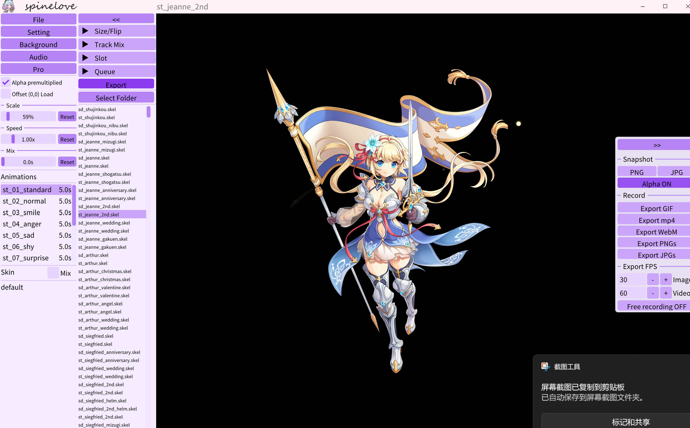

<div align="center">

## Features

- Preview Spine animations across **9 runtime versions** (2.1 through 4.2)
- Export frames as **PNG / JPG**, sequences, **GIF**, **MP4**, or **WebM**
- Multi-skin blending, multi-track layering, and animation queue playback
- Mouse slot hover detection with bounding box inspection
- Audio sync playback alongside animations
- Themeable UI with dark mode, custom hue/saturation/brightness, and font size control
- Multi-language support: English · 简体中文 · 繁体中文 · 日本語 · 한국어

---

## Interface Overview

The window is divided into three areas:

```
┌─────────────┬──────────────────────────┬──────────────┐
│  Left Panel │        Canvas            │  Right Panel │
│  (controls) │   (animation preview)    │  (tools)     │
└─────────────┴──────────────────────────┴──────────────┘
```

Press `<<` to collapse both panels for a fullscreen canvas view. Hover the left edge to reveal `>>` and restore them.

---

## Left Panel

### File
Opens a file picker to load a Spine skeleton file (`.skel` / `.json` + atlas).

### Setting
Opens the Settings dialog with three sub-pages:

| Sub-page | Description |
|---|---|
| **Language** | Switch the UI language. Options are loaded from bundled language files (Simplified Chinese, Traditional Chinese, Japanese, Korean, English). |
| **Theme** | Adjust UI appearance — sliders for Hue, Saturation, and Brightness; Dark Mode toggle; Font Size; custom Title Bar background image. |
| **Render BG Color** | Set the canvas background color via a color picker. Defaults to black. |

### Background
Opens a file picker to load a background image displayed behind the animation on the canvas. Hold `Ctrl` to control background position and scale.

### Audio
Opens a file picker to load one or more audio files for synchronized playback.

| Control | Description |
|---|---|
| **Index / Total** | Shows the current audio file index and total count, e.g. `1 / 3`. |
| **Filename** | Displays the name of the current audio file. |
| **Play / Stop** | Starts or stops playback of the current audio file. |
| **Loop** | Toggles looping for the current audio. Highlighted when active. |
| **Vol** | Adjusts playback volume from `0.0` to `1.0`. |
| **Auto** | Automatically plays audio when the animation changes. |
| **`<` / `>`** | Switches to the previous / next audio file. |

### Alpha Premultiplied
Toggles premultiplied-alpha blending for the rendered skeleton.

### Offset (0,0) Load
When checked, resets the skeleton's draw offset to `(0, 0)` every time a new file is loaded. Useful for complex multi-skin files.

### Scale
Slider from `10%` to `500%` that scales the rendered skeleton. **Reset** restores to 100%.

### Speed
Slider from `0×` to `5×` that controls animation time scale. **Reset** restores to 1.0×.

### Mix
Slider from `0 s` to `1 s` that sets the default cross-fade duration between animations. **Reset** restores to 0 s.

### Animations
Lists all animations contained in the loaded skeleton. Click to play.

### Skin / Skin Mix
Lists all skins in the loaded skeleton.

| Mode | Description |
|---|---|
| **Single** (default) | Click a skin to apply it; click again to revert to the default skin. |
| **Mix** | Enable the Mix checkbox to blend multiple skins simultaneously using the Spine skin combine API. |

---

## Right Panel

### Size / Flip
Displays the current window size, skeleton base size, and draw offset.

| Button | Description |
|---|---|
| **Mirror** | Flips the skeleton horizontally (toggles X-flip). |
| **Rotate** | Rotates the skeleton 90° clockwise. |

### Track Mix
Layer multiple animations on separate Spine tracks simultaneously.

| Control | Description |
|---|---|
| **Animation list** | Multi-select list — check animations to add as tracks. |
| **Add** | Adds checked animations as active looping tracks. |
| **Clear** | Removes all active tracks and resets the list. |

### Slot
Manage slot visibility and interact with slots via the mouse.

**Exclude slot by filter** — type a keyword and press **Apply** to hide all slots whose names contain it.

**Mouse slot hover** — enable hover detection to inspect slots interactively:

| Control | Description |
|---|---|
| **Enable** checkbox | Activates hover detection on the canvas. |
| **Hovered slot** | Shows the name of the slot currently under the mouse. |
| **Pinned slot** | Left-click the canvas to pin a slot; it is highlighted in the list. |
| **Colour** swatch | Opens a color picker to change the highlight outline color. |
| **Slot bounding** | When a slot is pinned, shows its bounding-box coordinates (X, Y, W, H). |

### Queue
Build and play an ordered sequence of animations.

| Control | Description |
|---|---|
| **Dropdown** | Select an animation to add. |
| **+Add** | Appends the selected animation to the queue. |
| **Play / Stop** | Starts or stops sequential playback. |
| **Queue list** | Shows each entry's index and duration; current entry is highlighted. |
| **X** (per item) | Removes that entry from the queue. |
| **Clear** | Empties the entire queue. |

> **Note:** Queue export is only available while the queue is actively playing.

### Export
Opens the floating Export panel on the right edge.

---

## Export Panel

Click **Export** to open. Click **`>>`** at the top to close.

All exports are saved to the directory containing the executable.

### Snapshot

| Button | Description |
|---|---|
| **PNG** | Saves the current frame as a PNG image. |
| **JPG** | Saves the current frame as a JPG image. |
| **Alpha ON / OFF** | Toggles whether the snapshot preserves the alpha channel. |

### Record

| Button | Description |
|---|---|
| **Export GIF** | Records the current animation and exports it as an animated GIF. |
| **Export MP4** | Records and exports as an MP4 video. |
| **Export WebM** | Records and exports as a WebM video. Requires `ffmpeg.exe` in the root directory. |
| **Export PNGs** | *(Per-animation mode)* Exports each frame as a PNG sequence. |
| **Export JPGs** | *(Per-animation mode)* Exports each frame as a JPG sequence. |

### FPS

| Control | Range | Description |
|---|---|---|
| **Image** | 15–90 fps | Frame rate for GIF / PNG / JPG sequence exports. Supports mouse-wheel adjustment. |
| **Video** | 15–240 fps | Frame rate for MP4 / WebM video exports. Supports mouse-wheel adjustment. |

### Free Recording

| Mode | Description |
|---|---|
| **Free recording ON** | Manual start/stop — record any duration freely. |
| **Free recording OFF** | Per-animation mode — automatically records each animation separately. |

While recording, a progress bar replaces the export buttons. In free-recording mode a red **Stop Recording** button is shown.

---

## Keyboard Shortcuts

| Shortcut | Function |
|---|---|
| `F11` | Toggle fullscreen mode |
| `↑` | Select the previous Spine file in the list |
| `↓` | Select the next Spine file in the list |
| `↑` / `↓` release | Load the highlighted Spine file |
| `←` | Switch to the previous animation |
| `→` | Switch to the next animation |

### Mouse Controls

| Shortcut | Function |
|---|---|
| Left click on canvas | Switch to the next animation |
| Mouse wheel | Scale the current Spine display |
| `Shift` + Mouse wheel | Scale all visible Spine assets simultaneously |
| Left click and drag | Move the current Spine position |
| Left click + Mouse wheel | Adjust animation playback speed |
| `Ctrl` + Left click and drag | Move the background image |
| `Ctrl` + Mouse wheel | Scale the background image |
| Middle click | Reset Spine scale and auto-fit to the window |
| Mouse over canvas *(hover mode on)* | Detect the slot under the cursor |
| Left click on canvas *(hover mode on)* | Pin the hovered slot and highlight it in the Slot panel |

---

## Select Folder

Opens a folder picker. All Spine skeleton files found in the selected folder and subfolders are listed below the button.

- **Click** any file to load it
- **Right-click** a file to: add to Favorites, open the containing folder, or use the multi-model feature
- **Add Spine** — load multiple Spine assets simultaneously; manage them via the draggable floating window in the upper-right corner

### Favorites
Bookmark frequently used files. Favorites are stored by file path — if the path becomes invalid the entry will also become invalid.

---

## Dependencies

| Library | Purpose |
|---|---|
| [DxLib](https://dxlib.xsrv.jp/) | Rendering and window management |
| [Dear ImGui](https://github.com/ocornut/imgui) | Immediate-mode GUI |
| [spine-runtimes](https://github.com/EsotericSoftware/spine-runtimes) | Spine skeletal animation runtimes (C & C++) |
| [FFmpeg](https://github.com/BtbN/FFmpeg-Builds) | Video encoding for MP4 / WebM export |

---

<div align="center">

MIT License © 2026 yihkllo

</div>
