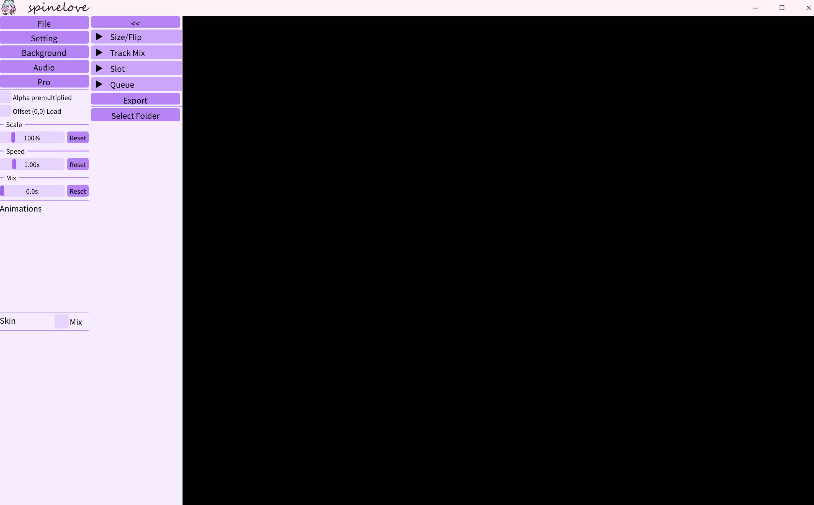

# SpineLove

**SpineLove** is a Windows desktop Spine animation viewer and export tool.

Supported Spine runtime versions: **2.1 · 3.4 · 3.5 · 3.6 · 3.7 · 3.8 · 4.0 · 4.1 · 4.2**

---

## UI Overview

### Select Folder
Opens a folder picker. All Spine skeleton files found in the selected folder are listed below the button. Click any file to load it; hover to see the parent folder name as a tooltip.

---

The interface is divided into a **Left Panel** (file & playback controls), a **Right Panel** (size, slot, queue & export), and a **canvas** in the middle for animation preview.

---

## Left Panel

### File
Opens a file picker to load a Spine skeleton file (`.skel` / `.json` + atlas).

### Setting
Opens the Settings dialog with three sub-pages:

| Sub-page | Description |
|---|---|
| **Language** | Switch the UI language. Options are loaded from bundled language files (Simplified Chinese, Traditional Chinese, Japanese, Korean, English). |
| **Theme** | Adjust UI appearance. Sliders for Hue, Saturation, and Brightness; Dark Mode toggle; Font Size adjustment; custom Title Bar background image. |
| **Render BG Color** | Set the canvas background color via a color picker. Defaults to black. |

### Background
Opens a file picker to load a background image displayed behind the animation on the canvas.

### Audio
Opens a file picker to load one or more audio files for synchronized playback.

Once audio is loaded, the following controls appear:

| Control | Description |
|---|---|
| **Index / Total** | Shows the current audio file index and total count, e.g. `1 / 3`. |
| **Filename** | Displays the name of the current audio file. |
| **Play / Stop** | Starts or stops playback of the current audio file. |
| **Loop** | Toggles looping for the current audio. Highlighted when active. |
| **Vol slider** | Adjusts playback volume from 0.0 to 1.0. |
| **Auto** | Automatically plays audio when the animation changes. Highlighted when active. |
| **`<`** | Switches to the previous audio file in the loaded list. |
| **`>`** | Switches to the next audio file in the loaded list. |

#### Alpha premultiplied
Toggles premultiplied-alpha blending.

#### Offset (0,0) Load
When checked, resets the skeleton's draw offset to (0, 0) every time a new file is loaded.

#### Scale
Slider from 10% to 500% that scales the rendered skeleton. **Reset** restores to 100%.

#### Speed
Slider from 0× to 5× that controls animation time scale. **Reset** restores to 1.0×.

#### Mix
Slider from 0 s to 1 s that sets the default cross-fade mix duration between animations. **Reset** restores to 0 s.

---

### Animations
Lists all animations in the loaded skeleton.

### Skin / Mix
Lists all skins in the loaded skeleton.

| Control | Description |
|---|---|
| **Single mode** (default) | Click a skin to apply it. Click again to deselect (revert to default skin). |
| **Mix checkbox** | Enables multi-skin mixing mode. Check any combination of skins to blend them together. |

---

### `<<` (Hide panels)
Collapses both panels to give the canvas maximum space. Hover the left edge to reveal a **`>>`** button that restores them.

---

### Size/Flip *(collapsible)*
Displays current window size, skeleton base size, and draw offset.

| Button | Description |
|---|---|
| **Mirror** | Flips the skeleton horizontally (toggles X-flip). |
| **Rotate** | Rotates the skeleton 90° clockwise. |

---

### Track Mix *(collapsible)*
Layer multiple animations on separate Spine tracks simultaneously.

| Control | Description |
|---|---|
| **Animation list** | Multi-select list of all animations. Check the ones to add as tracks. |
| **Add** | Adds the checked animations as active looping tracks. |
| **Clear** | Removes all active tracks and resets the list. |

---

### Slot *(collapsible)*
Manage which slots are rendered and interact with slots via the mouse.

#### Exclude slot by filter
Type a text filter and press **Apply** to exclude all slots whose names contain the filter string.

#### Mouse slot hover
| Control | Description |
|---|---|
| **Enable** checkbox | Activates hover detection. Move the mouse over the canvas to highlight the slot under the cursor. |
| **Hovered slot** | Shows the name of the slot currently under the mouse. |
| **Pinned slot** | Click on the canvas while hovering to pin a slot. The pinned slot is highlighted in the list. |
| **Colour** swatch | Opens a color picker to change the highlight outline color. |
| **Slot bounding** | When a slot is pinned, toggle to show its bounding-box coordinates (X, Y, W, H). |

---

### Queue *(collapsible)*
Build and play an ordered sequence of animations.

| Control | Description |
|---|---|
| **Dropdown** | Select an animation to add to the queue. |
| **+Add** | Appends the selected animation to the queue. |
| **Play** | Starts playing the queue from the beginning. |
| **Stop** | Stops queue playback. |
| **Queue list** | Shows each entry's index and duration. The currently playing entry is highlighted. |
| **X** (per item) | Removes that entry from the queue. |
| **Clear** | Empties the entire queue and stops playback. |

---

### Export
Toggles the floating **Export panel** that slides in from the right edge.

## Export Panel (floating, right side)

Click **Export** to open. Click **`>>`** at the top to close.

| Button | Description |
|---|---|
| **PNG** | Saves the current frame as a PNG image. |
| **JPG** | Saves the current frame as a JPG image. |
| **Alpha ON / OFF** | Toggles whether the exported snapshot includes an alpha channel. |

### Record

| Button | Description |
|---|---|
| **Export GIF** | Records the current animation and saves it as an animated GIF. |
| **Export mp4** | Records the current animation and saves it as an MP4 video (requires FFmpeg). |
| **Export WebM** | Records the current animation and saves it as a WebM video (requires FFmpeg). Disabled while encoding. |
| **Export PNGs** | *(Per-animation mode only)* Exports each frame as a PNG sequence. |
| **Export JPGs** | *(Per-animation mode only)* Exports each frame as a JPG sequence. |

### Export FPS

| Control | Description |
|---|---|
| **Image** | Frame rate for GIF / PNG / JPG sequence exports (15–90 fps). Supports mouse-wheel adjustment. |
| **Video** | Frame rate for MP4 / WebM video exports (15–240 fps). Supports mouse-wheel adjustment. |
| **Free recording ON / OFF** | Toggle between *free recording* mode (manual start/stop) and *per-animation* mode (auto-records each animation separately). |

While recording or writing frames a progress bar replaces the export buttons. In free-recording mode a red **Stop Recording** button is shown.

---

## Dependencies

- DxLib
- Dear ImGui
- https://github.com/EsotericSoftware/spine-runtimes
- https://github.com/BtbN/FFmpeg-Builds

---
