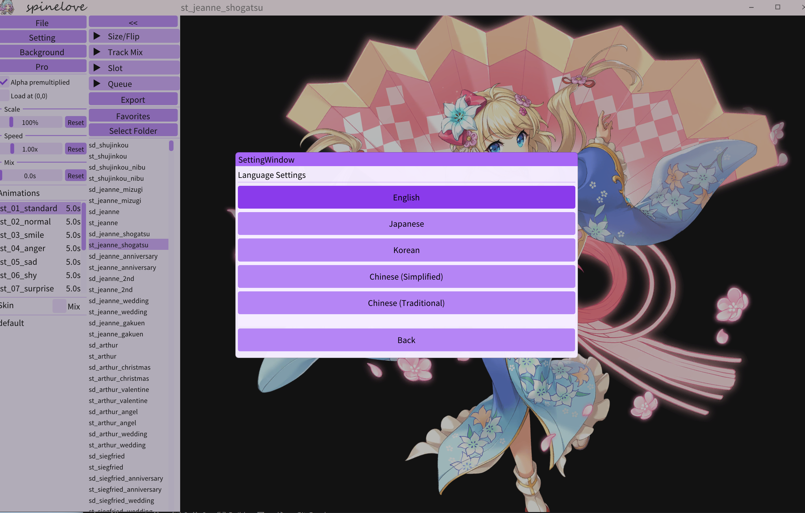
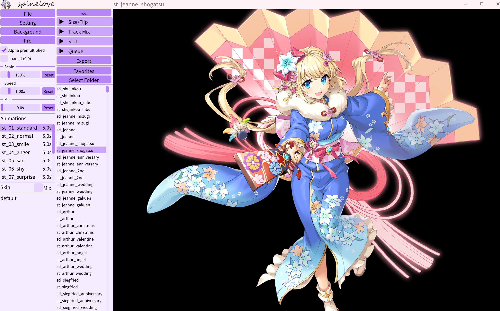

<div align="center">

# 🌸 SpineLove

**A lightweight, beautiful Spine viewer for Windows — preview, compose, and export Spine skeletons with ease.**

[](https://www.microsoft.com/windows)
[](https://learn.microsoft.com/windows/win32/direct3d11/)
[](http://esotericsoftware.com/)
[](https://isocpp.org/)
[](LICENSE)
[](README_zh.md)

<br/>



</div>

---

## ✨ Highlights

- 🎯 **Nine Spine runtimes in one app** — 2.1, 3.4, 3.5, 3.6, 3.7, 3.8, 4.0, 4.1, 4.2
- 🗂️ **Folder browsing** with recursive scan, favorites, and arrow-key navigation
- 🪄 **Multi-Spine layering** — stack several skeletons on a single canvas, reorder, hide, and pan together
- 🎬 **Animation queue** — chain animations and play or export them as one sequence
- 🔍 **Slot inspection** — hover the canvas to identify slots, pin them, hide by name or checkbox
- 🖼️ **Export anything** — PNG / JPG snapshots, PNG / JPG frame sequences, MP4 / WebM / GIF via ffmpeg
- 🌐 **Five UI languages** — English, 简体中文, 繁體中文, 日本語, 한국어
- 🎨 **Custom titlebar, themes, and background image** with independent pan & zoom

---

## 🌐 Languages

| Code | Language |
|---|---|
| `en` | English *(default)* |
| `zh_CN` | 简体中文 |
| `zh_TW` | 繁體中文 |
| `ja_JP` | 日本語 |
| `ko_KR` | 한국어 |

Switch from **Setting → Language**. The choice is saved for the next launch.

<div align="center">

</div>

---

## 📦 Supported content

| Item | Details |
|---|---|
| Skeleton files | `.skel`, `.json` |
| Atlas files | `.atlas`, `.atlas.txt` (same base name, next to the skeleton) |
| Spine versions | **2.1** · **3.4** · **3.5** · **3.6** · **3.7** · **3.8** · **4.0** · **4.1** · **4.2** |
| Background image | PNG / JPG preview, exported into snapshots, frames, and video |
| Layers | Single Spine, or multiple Spine skeletons composed on one canvas |

> When opening several skeleton files at once, use files that share the same Spine version **and** the same data format (all `.json` or all `.skel`).

---

## 🚀 Quick start

1. Run **`spine love.exe`**.
2. Click **`File`** to open one or more `.skel` / `.json` files.
3. Click **`Select Folder`** to scan a folder recursively — then browse with the arrow keys or the file list.
4. Pick an animation from the **Animations** panel, or use **←** / **→**.
5. Use the right-side panels for transform, mixing, slot tools, queue, and export.

---

## 🖱️ Controls

| Input | Action |
|---|---|
| Left click on canvas | Switch to the next animation *(when slot-hover is off)* |
| Left drag | Move the active Spine layer |
| **Shift** + left drag | Move **all** visible Spine layers together |
| Mouse wheel | Zoom the active layer around the cursor |
| **Shift** + wheel | Zoom **all** visible layers around the cursor |
| Middle click | Reset and fit the active layer |
| **Shift** + middle click | Reset and fit **all** visible layers |
| **Ctrl** + left drag | Move the background image |
| **Ctrl** + wheel | Scale the background image |
| Left + right drag | Move the window |
| **←** / **→** | Previous / next animation |
| **↑** / **↓** | Previous / next skeleton in the scanned folder |
| **F11** | Toggle fullscreen |

> Keyboard shortcuts are ignored while you're typing in a text field or interacting with a UI control.

---

## 🧩 Panels at a glance

### 📁 File & folder
**`File`** opens one or more skeleton files. **`Select Folder`** scans a folder recursively for `.json` and `.skel` files; the resulting list supports quick preview, favorites, opening the containing folder, and adding files as new Spine layers. Loading a single file while multi-Spine mode is active will ask before replacing the current layers.

### ⚙️ Setting
Language, theme, background color, and other UI options. The language choice persists across launches.

### 🖼️ Background
Load a background image to preview or export. Move with **Ctrl + drag**, scale with **Ctrl + wheel**.

### 🎚️ Alpha Premultiplied · Load At (0,0)
- **Alpha Premultiplied** — premultiplied-alpha rendering toggle for the active Spine (default on).
- **Load At (0,0)** — when on, newly loaded skeletons use zero offset. When off, the opening pose is centered.

### 📐 Scale / Speed / Mix
Display scale of the active layer, playback speed, and the blend time used when switching animations.

### 🎞️ Animations
Names and durations. Click an animation to play it, or use **←** / **→**.

### 👗 Skin
Pick one skin in normal mode. Turn on **Mix** to combine multiple skins.

### 📏 Size / Flip
Window size, skeleton size, and current offset — plus **Mirror** (horizontal flip) and **Rotate** (90° clockwise) for the active Spine.

### 🧵 Track Mix
Select one or more animations and press **Add** to layer them on top of the main animation. **Clear** removes the extra tracks.

### 🔎 Slot tools
- **Exclude slot by items** — hide or show slots with checkboxes.
- **Hide slots by name text** — type part of a slot name and apply (ASCII is case-insensitive).
- **Mouse slot hover** — hover the canvas to detect a slot, click to pin it, and draw its outline.
- Slot bounds can be shown for the currently detected or pinned slot.

### 🎬 Queue
Build an ordered animation queue.
- Choose an animation and press **+ Add**.
- **Play** runs the queue in order; **Stop** halts it; **Clear** empties it.
- The currently playing or exporting item is highlighted.

### 🪄 Spines
When multiple Spines are loaded, the floating **Spines** panel appears:
- Click a name to make that Spine active.
- Toggle visibility per layer.
- Reorder draw order with up / down.
- Hold **Shift** while dragging, scrolling, or middle-clicking to operate **all** visible layers at once.

---

## 📤 Export

Open the export panel with **`Export`** on the right side.

### Snapshot
| Button | Output |
|---|---|
| `PNG` | Current view as PNG |
| `JPG` | Current view as JPG |
| `Alpha ON` | Keep transparent background (PNG) |
| `Alpha OFF` | Burn the current background into the image |

### Frame sequence
Writes a PNG or JPG image sequence. **Image FPS** controls the output frame rate.

### Video
Renders PNG frames first, then encodes with **`ffmpeg.exe`**.

| Format | Notes |
|---|---|
| `MP4` | H.264 / AAC container |
| `WebM` | VP9 / Opus container |
| `GIF` | Animated GIF |

**Video FPS** controls MP4 / WebM / GIF output.

> Place `ffmpeg.exe` next to `spine love.exe`, in a `tools/` folder, or anywhere on your `PATH`. If it's missing, the app shows a download prompt.

### Queue Export
Toggle **`Queue ON`** to export the animation queue instead of just the current animation. An empty queue stops the export with an error message.

---

## 📦 Release package layout

A typical release ships with:

```
spine love.exe
lang/
render_d3d11/
app.png
NotoSansSC-Regular.ttf
ffmpeg.exe      (optional)
```

Do **not** ship build artifacts such as `.pdb`, `.lib`, `.exp`, `.obj`, or the `out/` directory.

---

## 🛠️ Build from source

**Requirements**
- Windows 10 or newer
- Visual Studio 2022
- C++17 toolset

**Steps**
1. Open `spinelove.sln` in Visual Studio.
2. Select **`x64` / `Release`**.
3. Build the **`SpineLove`** project.

Default output:

```text
out/build/sln/bin/x64/Release/spine love.exe
```

---

## 📂 Project layout

```
spinelove/
├─ main/
│  ├─ viewer/              # window, input, panels, render loop
│  ├─ render_d3d11/        # D3D11 renderer, overlay, textures, shaders
│  ├─ runtime_v2/          # version-tagged Spine runtimes (2.1 – 4.2)
│  ├─ runtime_shared/      # version-agnostic skeleton/layer/probe APIs
│  ├─ spine/               # upstream Spine C++ sources by version
│  ├─ imgui/               # ImGui binding, fonts, theme, i18n, titlebar
│  └─ image_exporter.*     # PNG/JPG encoding pipeline
├─ third_party/            # Dear ImGui, stb
├─ vs/                     # Visual Studio project files
└─ spinelove.sln
```

---

## ⚖️ Notes

This project is **not** affiliated with Esoteric Software. *Spine* and the bundled runtime code belong to their respective owners and license terms. Bundled third-party components retain their own license notices — see [`LICENSE`](LICENSE) and the headers inside `third_party/`.

<div align="center">

— made with 💖 for Spine artists & hobbyists —

</div>
