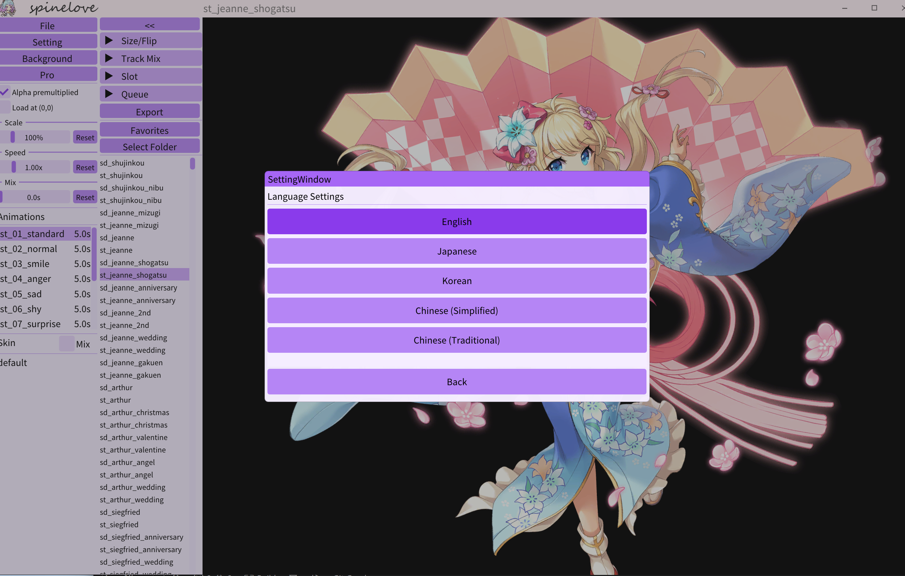

# SpineLoveEX

**Spine / Live2D viewer for Windows — preview, export, and browse models quickly**

> # ⚡ Fastest way to import
>
> ## Drag a folder containing Spine (or Live2D) files into the window
>
> ## The app picks out the relevant assets and lists them under "Select Folder" on the left

  
  
  
  
  

---

## ✨ Features

- **Live2D support (new)** — switch to the Live2D workspace from the top-left corner
- **Supported Spine runtimes** — 2.1, 3.1, 3.4, 3.5, 3.6, 3.7, 3.8, 4.0, 4.1, 4.2
- **Recursive folder browsing** — favorites and arrow-key navigation
- **Multi-Spine layer compositing** — stack several skeletons on one canvas; reorder, hide, or move them together
- **Animation queue** — chain multiple animations to play in order or export in one go
- **Slot inspection** — hover to identify slots, click to pin, hide by checklist or by name
- **Multi-format export** — PNG / JPG screenshots, PNG / JPG frame sequences, MP4 / WebM / GIF (via ffmpeg)
- **2 UI languages** — English, Simplified Chinese
- **Custom title bar + themes + background image** — the background can be panned and zoomed independently
- **Desktop pet mode (beta)** — the model leaves the window and stays on top of the desktop; drag it, zoom it, let it switch motions at random

---

## 🌐 UI Language

| Code    | Language                |
| ------- | ----------------------- |
| `en`    | English                 |
| `zh_CN` | 简体中文 *(default)*        |

Switch under **Setting → Language** in the top-left corner; the choice is remembered on the next launch.

---

## 📦 Supported Content

| Item             | Details                                                                                                                       |
| ---------------- | ----------------------------------------------------------------------------------------------------------------------------- |
| Skeleton files   | `.skel`, `.skel.bytes`, `.json`; exported assets inside `.zip` archives |
| Atlas files      | `.atlas`, `.atlas.txt` (same name, next to the skeleton file)                                                                 |
| Spine versions   | **2.1** · **3.1** · **3.4** · **3.5** · **3.6** · **3.7** · **3.8** · **4.0** · **4.1** · **4.2**                             |
| Live2D models    | Cubism 3+ `.model3.json` (loaded together with `.moc3`, textures, motions, expressions and voice); Cubism 2 `.model.json` is not supported |
| Background image | PNG / JPG; included in screenshots, frame sequences and video export                                                          |
| Layers           | A single Spine, or several Spines composed on one canvas                                                                      |

> When opening several skeleton files at once, use files of the **same Spine version** and the **same data format** (all `.json` or all `.skel`).

---

## 🚀 Quick Start

1. Run `SpineLoveEX.exe`.
2. Drag in a folder containing `.skel`, `.skel.bytes`, `.json` or `.zip` resources.
3. Click `Select Folder` to scan a folder recursively, then browse with the arrow keys or the list.
4. Pick an animation in the **Animations** panel, or switch with **←** / **→**.
5. Use the panels on the left to adjust transforms, track mixing, slots and the queue. Open the export panel with the button at the bottom right.

---

## 🖱️ Mouse & Shortcuts

| Input                    | Action                                                    |
| ------------------------ | --------------------------------------------------------- |
| Left-click on canvas     | Next animation *(when mouse slot hover is off)*           |
| Left-drag                | Move the current Spine layer                              |
| **Shift** + left-drag    | Move **all** visible Spine layers together                |
| Mouse wheel              | Zoom the current layer around the cursor                  |
| **Shift** + wheel        | Zoom **all** visible layers around the cursor             |
| Middle-click             | Reset and fit the current layer                           |
| **Shift** + middle-click | Reset and fit **all** visible layers                      |
| **Ctrl** + left-drag     | Move the background image                                 |
| **Ctrl** + wheel         | Zoom the background image                                 |
| Left + right drag        | Move the window                                           |
| **←** / **→**            | Previous / next animation                                 |
| **↑** / **↓**            | Previous / next skeleton file in the folder list          |
| **F11**                  | Toggle fullscreen                                         |

> Keyboard shortcuts are ignored while you are typing text or interacting with UI controls.

---

## Panels

### 📁 File & Folder

`File` opens skeleton files. `Select Folder` scans `.json` and `.skel` files recursively; the list supports quick preview, favorites, opening the containing folder, and adding a file as a new Spine layer. In multi-Spine mode, loading a file the normal way first asks whether to replace the current layers.

### ⚙️ Setting

Language, theme, background color and other UI options. The language choice is saved and applied on the next launch.

### 🖼️ Background

Load a background image for preview or export. **Ctrl + drag** to move, **Ctrl + wheel** to zoom.

### 🎚️ Alpha Premultiplied · Load At (0,0)

- **Alpha Premultiplied** — premultiplied-alpha rendering toggle for the current Spine (on by default).
- **Load At (0,0)** — when on, newly loaded skeletons use a `(0,0)` offset; when off, they are centered on their opening pose.

### 📐 Scale / Speed / Mix

Display scale, playback speed, and the mix duration used when switching animations, for the current layer.

### 🎞️ Animations

Animation names and durations. Click to play, or switch with **←** / **→**.

### 👗 Skin

Pick a single skin in normal mode. Turn on **Mix** to check several skins and show them combined.

### 📏 Size / Flip

Shows window size, skeleton size and current offset; provides **Mirror** (horizontal flip) and **Rotate** (90° clockwise).

### 🧵 Track Mix

Select one or more animations and click **Add** to layer them on top of the main animation as secondary tracks. **Clear** removes them.

### 🔎 Slot Tools

- **Exclude slot by items** — show or hide slots with a checklist.
- **Hide slots by name text** — type part of a slot name and apply; case-insensitive for English.
- **Mouse slot hover** — hover to identify a slot, click to pin it and draw its outline.
- The bounds of the identified or pinned slot can be displayed.

### 🎬 Queue

Build an ordered animation queue.

- Select an animation and click **+ Add** to append it.
- **Play** runs the queue in order, **Stop** stops it, **Clear** empties it.
- The current queue item is highlighted during playback and export.

### 🪄 Spines

A floating **Spines** panel appears when several Spines are loaded:

- Click a name to make it the active target.
- Show / hide each layer individually.
- Reorder drawing with the up / down buttons.
- Combine **Shift** with drag / wheel / middle-click to operate on all visible layers at once.

---

## 📤 Export

Click `Export` on the right to open the export panel.

### Screenshot

| Button      | Output                                      |
| ----------- | ------------------------------------------- |
| `PNG`       | Save the current frame as PNG               |
| `JPG`       | Save the current frame as JPG               |
| `Alpha ON`  | Keep the transparent background (PNG)       |
| `Alpha OFF` | Bake the current background into the image  |

### Frame Sequence

Outputs a PNG or JPG image sequence. **Image FPS** controls the frame rate.

### Video

Renders PNG frames first, then calls `ffmpeg.exe` to encode them.

| Format | Notes          |
| ------ | -------------- |
| `MP4`  | H.264 video without audio |
| `WebM` | VP9 video without audio; optional transparent background |
| `GIF`  | Animated GIF   |

**Video FPS** controls the frame rate for MP4 / WebM. **GIF FPS** controls the GIF frame rate separately.

> Put `ffmpeg.exe` in `main/` or `main/tools/` inside the installation folder, or on the system `PATH`. If it cannot be found, the export panel shows a download prompt.

### Queue Export

With `Queue ON`, the whole animation queue is exported instead of just the current animation. Exporting with an empty queue stops with an error.

## ⚖️ Notice

The *Spine* name and the bundled runtime code belong to their respective owners and are subject to their license terms. See [LICENSE](LICENSE), [source notices](docs/licenses/source-notices.txt) and `docs/licenses/` for third-party licenses and notices.

— Made with 💖 for 2D creators and enthusiasts —
